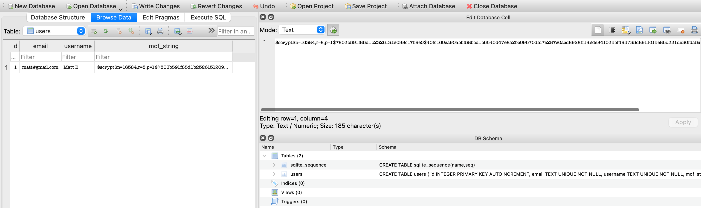

# Web User Authentication Full Stack Simulator
The goal of this project is to demonstrate how passwords are securely stored on a backend, and how the frontend communicates with the backend. In order to accomplish this, I avoided using any frameworks, libaries, or external tools: the frontend for this project is developed using plain HTML, CSS, and JS, and the backend is developed using python standard libraries only. Thus, this project unboxes how libraries like Flask or Django actually work, and shows how something as simple as a SQLite3 database can be used to safely store user information. Python's `hashlib` (sha512 and scrypt, selectable) was used in order to hash passwords and store them in a database using Modular Crypt Format (MCF).

## File overview
This project has many files which incorporate a webserver, a router, a frontend, a database manager, and my personal implementation of the sha512 hashing algorithm. Below lists out each file and their purpose

- **app.py** - Implements the web server, router, and database manager to create a working application. This file is what is run in order to start the web server.
- **utils/securedb.py** - Implements a database manager in a class named SecureDB.
- **utils/server.py** - Implements a router for adding API routes in an app and an HTTP server for handling GET and POST requests.
- **utils/sha512.py** - My personal implementation of SHA512. Added in case users are curious on how hashing algorithms work and are implemented.
- **static/script.js** - Javascript file which handles talking to the application API.
- **static/styles.css** - CSS styles for the web page.
- **index.html** - HTML for rendering the forms.
## Walkthrough - How To Use

### 1. Start the web server
First, clone this repository
```
git clone https://github.com/mattbriggs04/web-user-auth.git
```
Ensure you have a recent verson of python installed (>= Python 3.9). Only the python standard library is used, so there are no additional requirements for everything to work. Run `app.py`.
```
python3 app.py
```
This will start a webserver on port 8020 by default:

```
> python3 app.py
Server started on http://localhost:8020
```

### 2. Create account(s)
Ctrl/Cmd + Click `http://localhost:<port>` or copy and paste the url into a web browser in order to open the server. Once the server is opened, you should be met with this page:


This indicates that the webserver successfully sent over the HTML, CSS, and JS files when your browser requested them. In your terminal, you also should see log statements indicating that the server sent them.

Now, fill out the fields to create a username and password. There are some very basic restrictions:

- Every field must be filled out
- The Password and Confirm Password field must match
- Username must not already be in use
- Email must not already be in use

> **User Challenge**: Add more restrictions! Maybe enforce that a username cannot have a space or special characters (a great use case for regular expressions). Or create a set of rules for passwords. The SecureDB class already has a `_validate_password` method, which currently only enforces that password length is atleast 5 characters.

Once you have entered credentials, click the create account button, which should give a success message:


### 3. Verify database creation
Creating an account will create a new SQLite3 database called `users.db` if it does not already exists. Using [DB Browser for SQLite](https://sqlitebrowser.org/), we can view the created accounts, along with their securely stored passwords in our database:



The passwords are stored in a format known as Modular Crypt Format (MCF), a common format used to store information about cryptographic algorithm. The MCF strings are stored in the `mcf_string` column, formatted as:
```
$<hash_algorithm>$<parameters>$<salt>$<hash>
```
If the algorithm has no parameters, they are omitted entirely. MCF is particularly useful when multiple different hashing algorithms, each with different parameters are used. This makes MCF perfect for this project, as it allows for any hashing algorithm to be added easily.

By default the SecureDB class allows for three hashing algorithms: *scrypt*, *sha512*, and *plaintext_salt*. These hashing algorithms can be chosen upon instantiation of the SecureDB() object in **app.py**.

> **User Challenge**: *plaintext_salt* is simply the concatenation of the plaintext password and the salt together. **Passwords should never be stored in plaintext in databases** (you'd be surprised by how many databases do this). See if you can add a plaintext password and only from the database entry figure out what the password is! Hint: see how the password is stored as a string in _pack_mcf (securedb.py).

### 4. Log In
Click the *click here to login* link from the sign up page to get to the login page.


Logging in works by verifying that the password given, when hashed, matches the username's hash stored in the database. First, try an invalid password:


Then, enter a valid set of credentials. This should log you in, displaying the username in the middle of the screen:


> **User Challenge**: Once you log in, all that is displayed is "Welcome, \<name\>". What else may a user log in contain?

## TODO List
- Add SSL (HTTPS). Since this is a simulator run locally, this is not a major issue. However, in deployment, it's essential that HTTPS is used for secure transmission of private data.

# License
This repository is under the MIT license. See `License.md` for more information.
